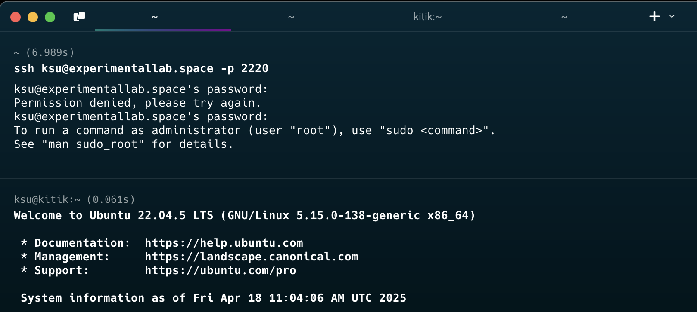
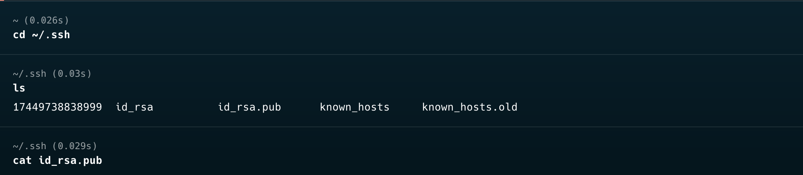
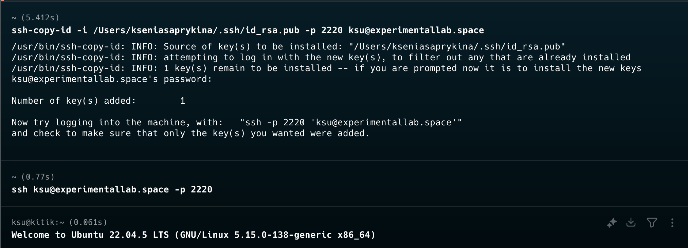
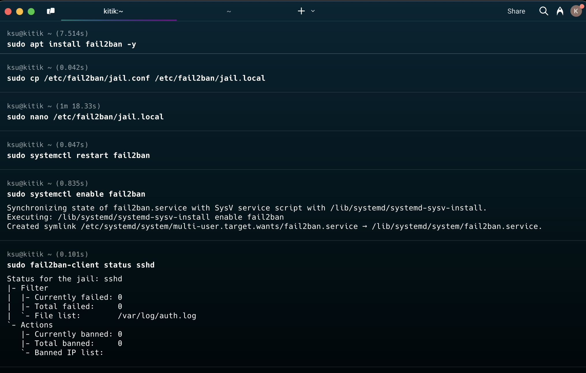
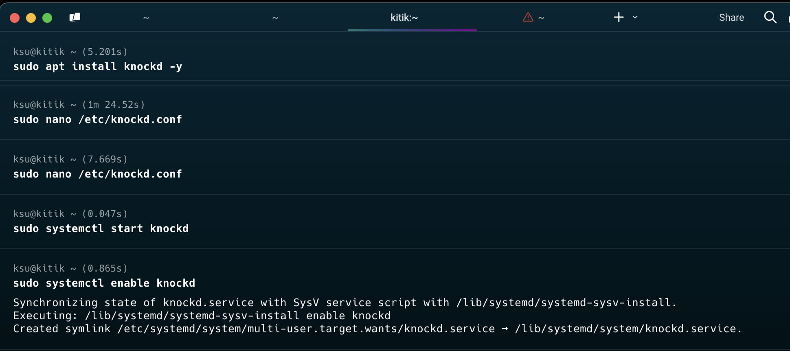
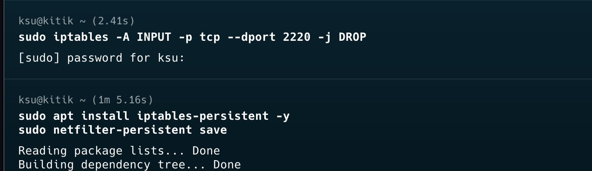
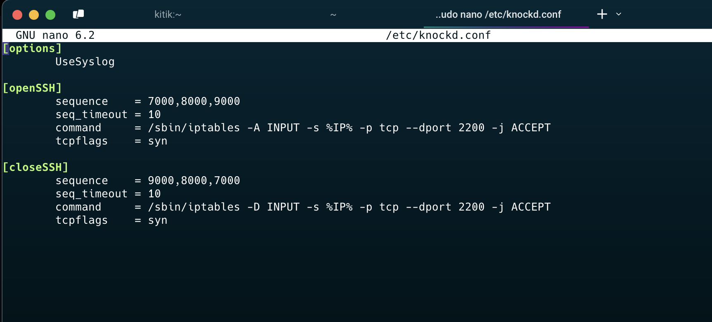
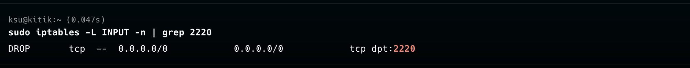
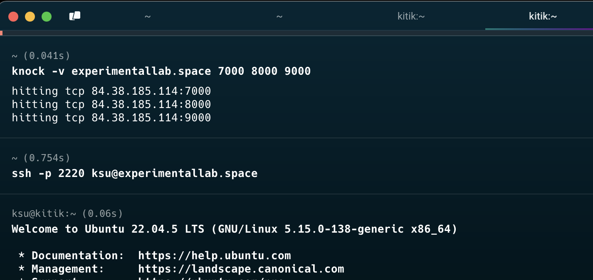
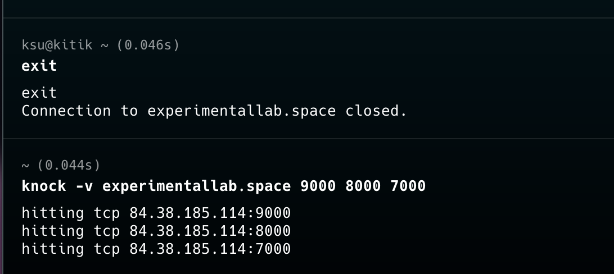

### вход по паролю и логину



### вход по ssh-key

сгенерила ключ и перенесла на вм 

```ssh-keygen -t rsa -b 4096```



### настройка fail2ban


скопировала jail.conf в jail.local для локальных настроек, поменяла только порт ```port = 2220``` и потыкала числа:
```bash
bantime = 600 # "bantime" is the number of seconds that a host is banned
findtime = 600 # A host is banned if it has generated "maxretry" during the last "findtime"
maxretry = 5  # "maxretry" is the number of failures before a host get banned
```

### настройка portknocking



**файл knockd.conf**

поменяла порт на нужный и ```seq_timeout``` увеличила, остальное оставила

 
**проверяем, что порт явно закрыт**


**стучимся и заходим, при выходе закрываем**



