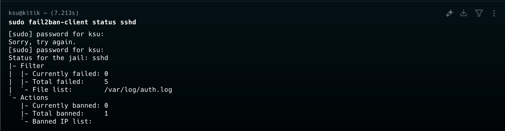
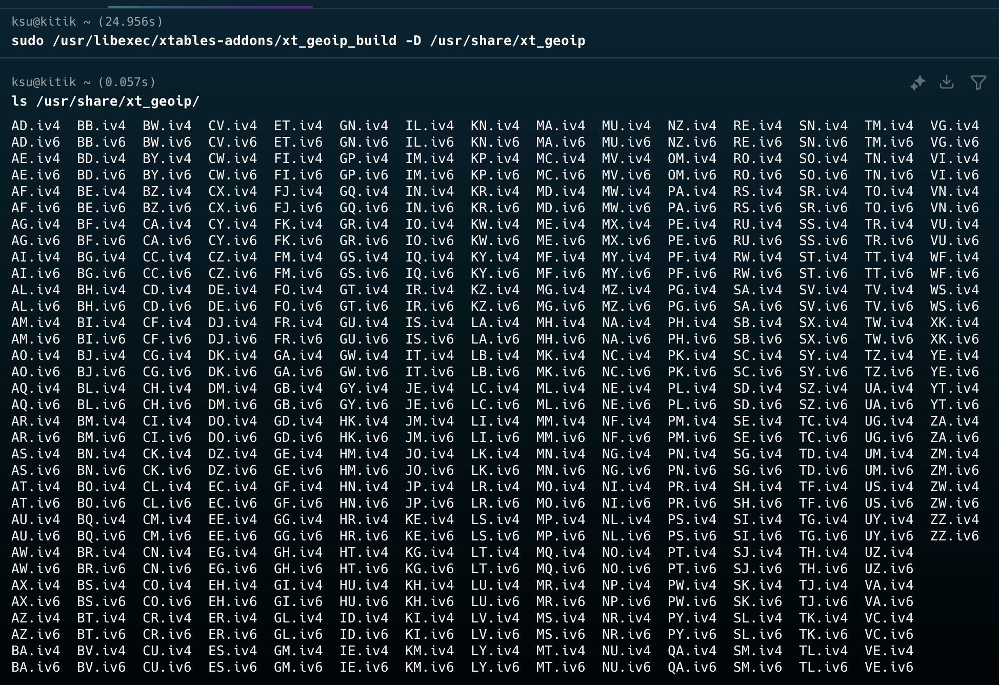

### вход по паролю и логину


### вход по ssh-key

сгенерила ключ и перенесла на вм 

```ssh-keygen -t rsa -b 4096```


### настройка fail2ban


скопировала jail.conf в jail.local для локальных настроек, поменяла только порт ```port = 2220``` и потыкала числа:
```bash
bantime = 600 # "bantime" is the number of seconds that a host is banned
findtime = 600 # A host is banned if it has generated "maxretry" during the last "findtime"
maxretry = 5  # "maxretry" is the number of failures before a host get banned
```
попытки зайти с неправильным паролем, доступа больше нет

ура доступ есть, в статусе видно прошлый бан


### настройка portknocking


**файл knockd.conf**

поменяла порт на нужный и ```seq_timeout``` увеличила, остальное оставила


**проверяем, что порт явно закрыт**


**стучимся и заходим, при выходе закрываем**


### настройка двухфактурной аутентификации
```bash
sudo apt install libpam-google-authenticator -y
google-authenticator
```
сканим qr и соглашаемся на нужные штучки

 
добавим в файл ```/etc/pam.d/sshd``` строчку:

и в файл ```/etc/ssh/sshd_config ```:

перезапускаем командой ```sudo systemctl restart sshd``` 

**теперь при входе нужен одноразовый пароль из Google Authenticator**


### настройка GeoIP-блокировки

устанавливаем нужные библиотечки
```bash 
sudo apt install xtables-addons-common
sudo apt install xtables-addons-common libtext-csv-xs-perl
```
загружаем базу данных стран
```bash
sudo /usr/libexec/xtables-addons/xt_geoip_dl
sudo mkdir -p /usr/share/xt_geoip
sudo /usr/libexec/xtables-addons/xt_geoip_build -D /usr/share/xt_geoip
```

разрешаем только РФ и сохраняем


**проверяем, что блокировка работает**


**при подключении под proxy сервером другой страны - никакого вывода, подключение невозможно**
